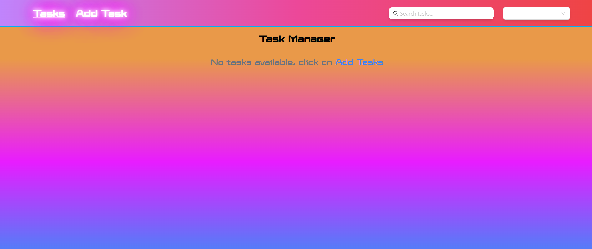
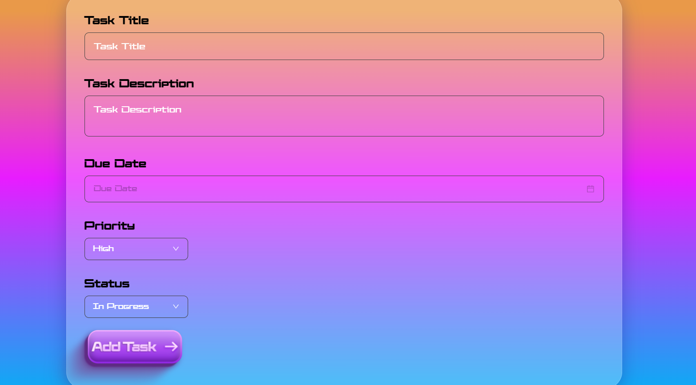
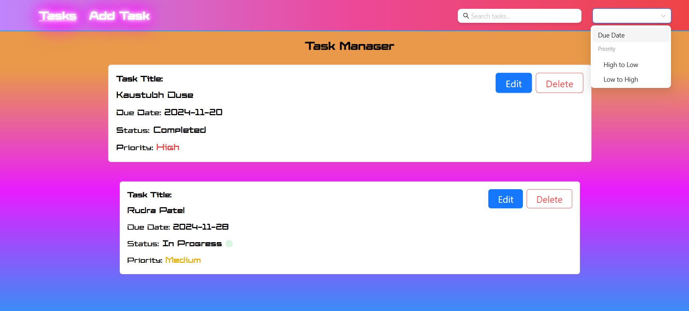
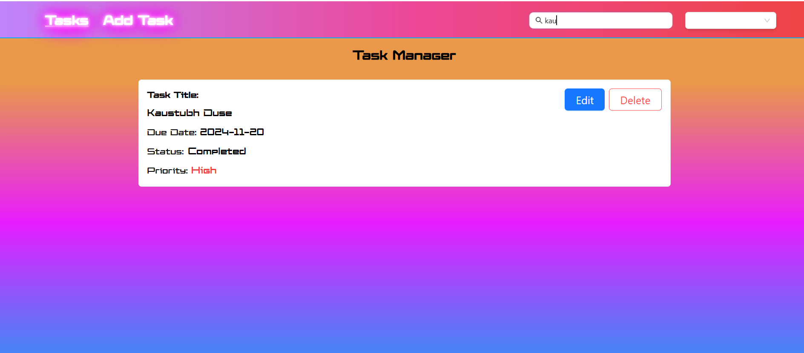

# 📋 Project Name: Task Manager Application

This project was bootstrapped with [Create React App](https://github.com/facebook/create-react-app).

## 🚀 Project Overview

### Key Features:
- 📌 Feature 1: Task Management 📝
- 📌 Feature 2: Describe the second feature of your app.
- 📌 Feature 3: Real-Time State Management with Redux ⚛️
- 📌 Feature 4: User-Friendly Interface 🎨
- 📌 Feature 5: Fast and Optimized Performance ⚡

---

## 🛠️ Technologies Used
- **React**: A JavaScript library for building user interfaces.
- **TypeScript**: For static typing.
- **Redux Toolkit**: For state management.
- **Tailwind CSS**: For utility-first CSS styling.

---

## ⚙️ Setup and Launch Instructions

### Prerequisites
Ensure you have the following installed on your system:
- **Node.js** (version >= 14)
- **npm** (version >= 6) or **yarn**

### Step 1: Clone the Repository
```bash
git clone https://github.com/kaustubhduse/Task-Manager
cd Task-Manager
```

### Step 2: Install Dependencies
```bash
npm install
# or
yarn install
```

### Step 3: Run the Application
```bash
npm start
# or
yarn start
```
The application will be running on [http://localhost:3000](http://localhost:3000).

### Step 4: Running Tests (if applicable)
```bash
npm test
# or
yarn test
```

### Step 5: Building for Production
```bash
npm run build
# or
yarn build
```
This will create an optimized production build in the `build` folder.


---

## 📝 Assumptions and Considerations
- It is assumed that you are filtering tasks for atleast 2 tasks added
- Haven't used local storage for storing the data but can use it in future if needed, instead used redux toolkit for storing data

---

## 📸 Screenshots
Add some screenshots of your application here:






---

## 🔄 Version Control
### Useful Git Commands:
- `git clone` - Clone a repository to your local machine.
- `git pull` - Pull the latest changes from the remote repository.
- `git add .` - Stage all changes for commit.
- `git commit -m "Your commit message"` - Commit staged changes.
- `git push origin main` - Push your changes to the `main` branch.

---

## 📚 Learn More
- [Create React App Documentation](https://facebook.github.io/create-react-app/docs/getting-started)
- [React Documentation](https://reactjs.org/)
- [Redux Toolkit](https://redux-toolkit.js.org/)
- [Tailwind CSS Documentation](https://tailwindcss.com/docs)

---

## 🛠️ Contributing
Contributions are welcome! Please open an issue or submit a pull request.

---

